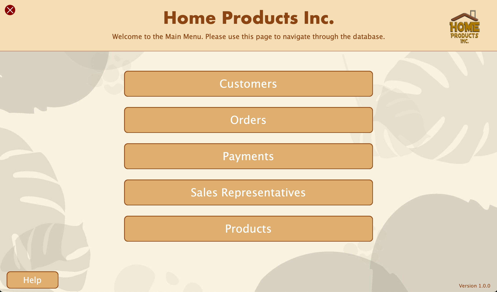

# Home Products Inc. - Database Management System

A full-stack desktop business management application built from the ground up in Java. This system provides a robust, multi-screen GUI to perform full CRUD operations on customers, orders, products, and more, all powered by a MySQL database.

**Link to project:** Will have demo video link once my computer gets fixed



## How to Run

### Prerequisites
*   Java Development Kit (JDK) 8 or higher.
*   MySQL Server running locally.
*   The MySQL Connector/J JAR file (e.g., `mysql-connector-j-9.1.0.jar`) placed in the root directory of the project.

### 1. Database Setup
1.  Ensure your MySQL server is running.
2.  Run the provided SQL schema script (`schema.sql`). This will create the `HomeProductsIncSmall` database, create all necessary tables, and seed them with initial data.
3.  Update the `DatabaseConfig.java` file with your local MySQL username and password if they are different from the defaults:
    ```java
    // in DatabaseConfig.java
    private static final String DB_USERNAME = "root";  // Update if needed
    private static final String DB_PASSWORD = ""; // Update with your password
    ```

### 2. Compilation
Open a terminal or command prompt in the project's root directory and run the following command. Make sure to replace `mysql-connector-j-9.1.0.jar` with the actual name of your MySQL connector file.

```bash
javac -cp .:mysql-connector-j-9.1.0.jar -d build/classes *.java
```
This will compile all `.java` files and place the `.class` files into the `build/classes` directory.

### 3. Running the Application
Once compiled, run the application with the following command:

```bash
java -cp build/classes:mysql-connector-j-9.1.0.jar MainApplication
```
The main menu of the application should now appear.

## How It's Made:

**Tech used:** Java, Java Swing, JDBC, MySQL

This application was built using a layered architecture to separate concerns and improve maintainability, with Java Swing for the front-end, a service layer for business logic, and JDBC for database communication.

*   **Front-End (View):** The user interface is built entirely with **Java Swing**, featuring a `CardLayout` to manage navigation between multiple screens. A central `UIFactory` class was implemented to create consistent, styled components (buttons, text fields, headers) across the application, demonstrating the Factory design pattern to reduce code duplication and enforce a uniform look and feel.

*   **Back-End (Controller/Service):** A dedicated service layer (`CustomerService`, `OrderService`, etc.) handles all business logic. This layer acts as an intermediary between the UI and the database, processing data and performing validation before executing database operations.

*   **Database (Model):** All data is stored in a **MySQL** database. The application uses **JDBC** for all database interactions, including complex transactional operations. For example, the order creation process is wrapped in a transaction to ensure that an order and all its line items are saved together, or the entire operation is rolled back on failure, guaranteeing data integrity.

*   **Data Validation:** Validation is implemented on both the front-end (e.g., limiting input length, enforcing character formats with `DocumentFilter` and `MaskFormatter`) and the back-end (e.g., checking for the existence of a customer or product before saving).

## Optimizations

Version 1.0.0 finished in January 2025; the latest September 2025 Version 1.0.1 fixed bugs regarding SQLException Errors and refactored the UI to reduce redundancies in the code.

*   **Centralized Validation :** Initially, some validation checks were duplicated across different service classes. I refactored this into a single method

*   **Transactional Integrity:** Some methods were built to be fully transactional. By disabling auto-commit, the application can execute multiple database inserts and its associated products as a single atomic unit. If any part fails, the entire transaction is rolled back, which preserves data integrity.

*   **Future Improvement - Connection Pooling:** Currently, the application opens a new database connection for each query. The next step for me would be to implement a JDBC connection pool (like HikariCP) to reuse existing connections.

## Lessons Learned:

This was my first time creating a full stack program with a front-end, back-end, and API to connect between layers. In the original code, I had over 9.9k lines, and lots of redundancies in the presentation later. I refactored all of this into a UIFactory class with static methods, reducing the amount of code by 4k lines. This was also my first time using an API, which I had trouble connecting at first, but got it down eventually.

Debugging a Duplicate entry error when saving an order taught me to synchronize the UI with the data model just before saving, and to wrap the entire multi-table insert operation in a transaction. It highlighted everything that goes on behind the back of an application.
